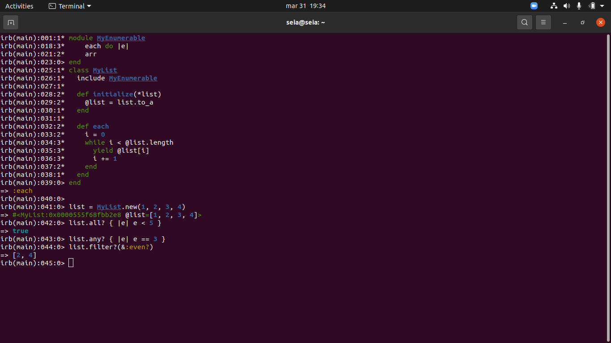

# Enumerable

> In this project we made a moduled project that returns the calculated values with the List class, allowing the user to see if any item is there, if all the items pass the requirements and filter them

## Built With

- Ruby
- Git, Github, Rubocop

## Getting Started

To get a local copy up and running follow these simple example steps.

### Prerequisites

run "git clone https://github.com/Nicolaswg/ruby-enumerable.git"
run "cd /ruby-enumerable"

### Usage
run list.all? condition to check if all the values meets the condition
run list.any? condition to check if any value meets the condition
run list.filter condition to filter the values that meets the conditions

## Authors

👤 **Nicolas Gonzalez**

Platform | Badge |
 --- | --- |
 **GitHub**  | [@Nicolaswg](https://github.com/Nicolaswg)
 **LinkdIn** | [LinkedIn](https://www.linkedin.com/in/nicolas-gonzalez-8623461a0/)

👤 **Lisandro Seia**

Platform | Badge |
 --- | --- |
 **GitHub**  | [@lisandroseia](https://github.com/lisandroseia)
 **LinkdIn** | [LinkedIn](https://www.linkedin.com/in/lisandro-seia-295120225/)

## 🤝 Contributing

Contributions, issues, and feature requests are welcome!

Feel free to check the [issues page](../../issues/).

## Show your support

Give a ⭐️ if you like this project!

## 📝 License

This project is [MIT](./MIT.md) licensed.
